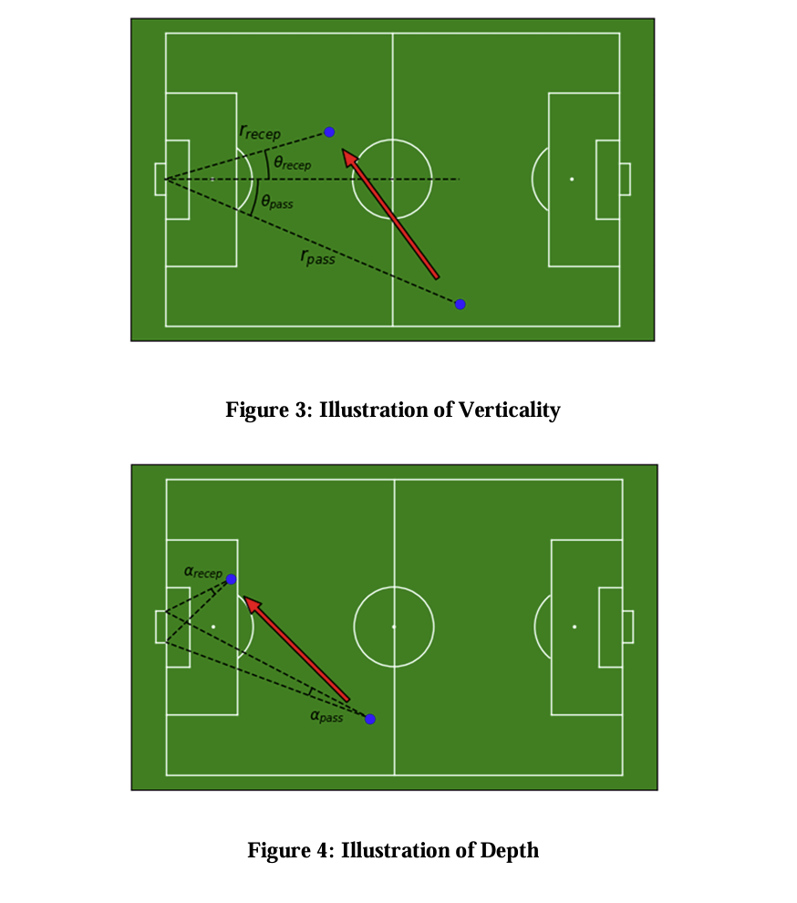
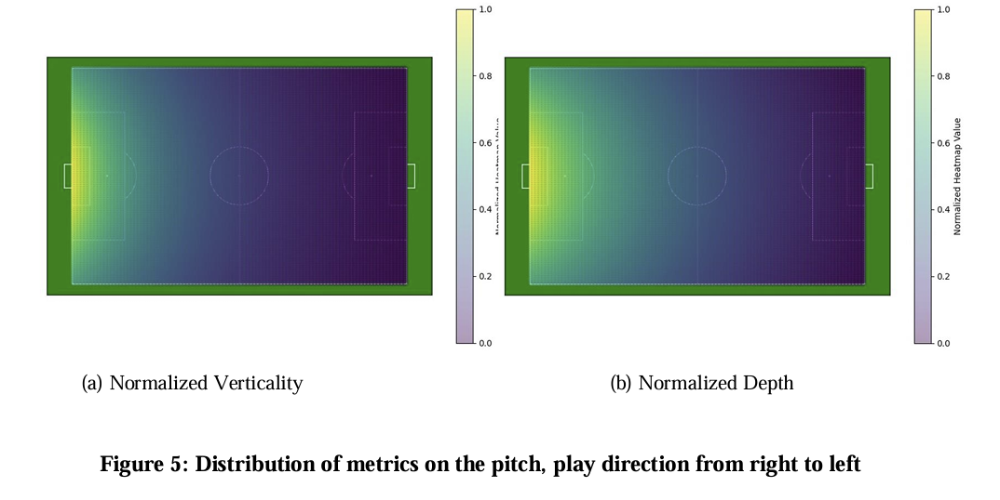
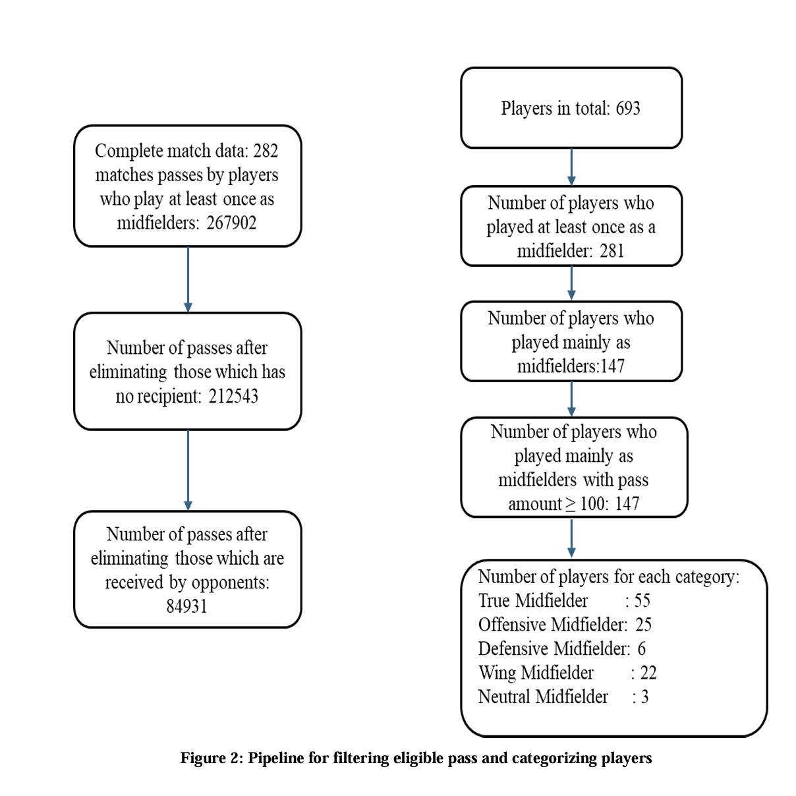
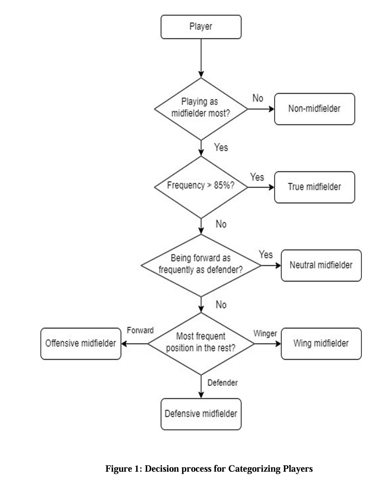
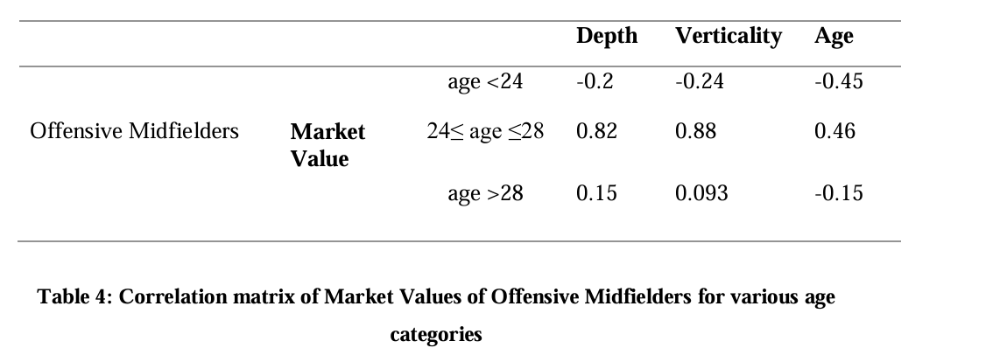

# Evaluation-of-Market-Value-of-Elite-Midfielders-by-Vertical-Passing-Ability

### Research Question

Does the vertical passing performance of elite midfielders correlate with their transfer market value? In other words, this project investigates whether midfielders who play more vertical passes (forward, line-breaking passes) tend to have higher market valuations.

### Hypothesis

Midfielders who consistently play with greater verticality per pass (i.e. higher average forward progression towards goal) are hypothesized to have higher transfer market values. The expectation is that strong forward-passing ability translates into greater player valuation.

### Methodology

* Data: Utilized Opta event data from 282 Ligue 1 matches (2020/21 season), capturing detailed pass events. The transfer market values of players at end of that season were obtained from Transfermarkt.

* Metrics: Defined two novel metrics – verticality and depth – to quantify a midfielder’s vertical passing ability. Verticality measures the forward distance component of passes (how much a pass advances play towards the opponent’s goal on average), while depth measures the effective forward penetration considering angle to goal. These metrics capture how aggressively a player progresses the ball upfield beyond simple pass counts.

* Player Categorization: Midfielders were grouped by role and age to enable nuanced analysis. Players were classified into sub-roles: true midfielders, offensive midfielders, defensive midfielders, wing midfielders, etc., based on their positional play percentages. They were further segmented by age (e.g. <24, 24–28, >28) to examine age-related trends.

* Analysis: Applied statistical correlation analysis to examine relationships between each player’s verticality/depth values and their market value. Separate correlation matrices were computed for each midfielder category and age group to identify where vertical passing performance aligns with market value.

### Key Insights

* Vertical Passing vs. Market Value: There is a significant positive correlation between the vertical passing metrics (verticality, depth) and market value for central midfielders – particularly “true” central midfielders and attacking midfielders – indicating that midfielders who excel at forward passes tend to be valued more highly. This correlation is most pronounced among mature players (roughly over 24 years old), who are often in their peak performance years.

* Role and Age Differences: Younger players (especially those under 24) show limited or no correlation between vertical passing performance and market value, suggesting that raw vertical passing ability alone doesn’t drive value in youth. Wing midfielders (wide players) also exhibit weaker and less consistent correlations – their market value often ties more to attributes like pace and crossing rather than vertical passing. In contrast, for mid-career true and offensive midfielders (mid-20s and above), higher verticality/depth strongly correlates with higher market value. (Notably, in the data a strong negative correlation was observed for under-24 offensive mids, indicating that very young attacking midfielders with high verticality were not yet highly valued.)

* Implications for Player Valuation: The metrics verticality and depth show promise as valuable key performance indicators (KPIs) for player valuation. In practice, clubs and analysts could use these vertical passing metrics to identify midfielders who contribute significantly to forward play. The study’s findings suggest these metrics add a useful new dimension to player evaluation, complementing traditional stats. Particularly for players in their prime, strong vertical passing ability is an indicator of higher market worth, underlining that tactical proficiency in advancing the ball vertically is linked to a midfielder’s financial value.

### Visualization 
Illustration of verticality  

Distribution of metrics  

Pipeline for eligible passes and players  

Decision process for categorizing players  

Correlation matrix of offensive midfielders:  
